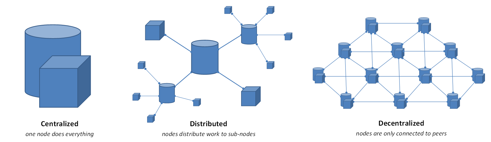
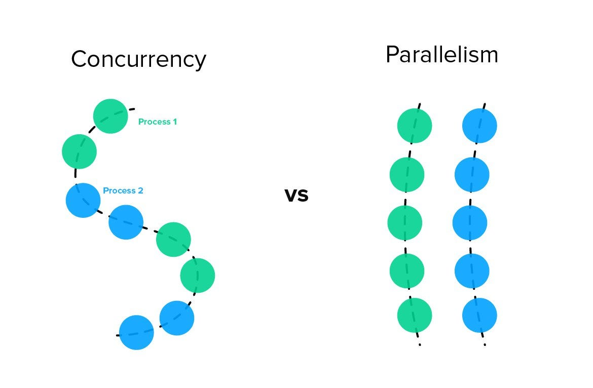

# Blockchain Ecosystem Implementation

## Description of the System

This project builds a fully functioning blockchain ecosystem that utilises a decentralised transaction processing system and employs the 'proof-of-work' consensus mechanism. It integrates four main components that work together to create a functioning cryptocurrency network:

### Wallets

Each wallet/client is a user interface that manages UTXOs (Unspent Transaction Outputs), each initialised with a balance of 100 Trump coins. A wallet tracks incoming transactions, automatically selecting appropriate UTXOs to cover the payment amounts and fees, and submit signed transactions to a randomly selected miner within the Peer2Peer network via TCP sockets.

### Miners

These act as nodes in the network that maintain their own local mempool of pending transactions using a priority based queue, where the transaction with the highest fee receives the highest priority. Once there is at least 4 transactions accumulated, each miner will begin to construct a block using 'proof-of-work' with a inter-changable difficulty level. Each miner will have their own copy of the overall blockchain, validate transactions, mine new blocks, and broadcast any updates to peers in the network.

### Bootstrap Node

This functions as the network's directory service, allowing for network discovery. It allows all miners to register their connectivity details, "IP_address:port_number", and enables wallets to retrieve a list of all available miners within the network. Concurrent access is managed using Python's threading library to allow multithreading and mutual exclusion thread-safe locks for memory-sharing critical zones.

### Blockchain

Composed of hash-linked blocks that contain transaction lists, Merkle trees for verification and avoidance of malicious miner activities, timestamps, and nonces used in mining operations. The system employs the SHA-256 hashing algorithm, with a configurable difficultly level used to specify the number of leading zeros required in a block's hash.


  
<sub>Source: <a href="https://medium.com/hackernoon/centralization-vs-decentralization-the-best-and-worst-of-both-worlds-7bfdd628ad09">medium.com/hackernoon (Centralized vs Decentralized)</a></sub>

## How to Run the Code

Below we will simulate the blockchain ecosystem with the following:

- 1 bootstrap node
- 3 miners
- 5 clients


Start each of the following components in seperate terminal windows (9 terminal windows) in the following order:

### The Bootstrap Node

In terminal 1, input:

```bash
python main.py bootstrap
```

### The Miners

In terminal 2, input:

```bash
python main.py miner Miner1 9001
```

In terminal 3, input:

```bash
python main.py miner Miner2 9002
```

In terminal 4, input:

```bash
python main.py miner Miner3 9003
```

### The Wallets

In terminal 5, input:

```bash
python main.py wallet Adam
```

In terminal 6, input:

```bash
python main.py wallet Bob
```

In terminal 7, input:

```bash
python main.py wallet Conor
```

In terminal 8, input:

```bash
python main.py wallet David
```

In terminal 9, input:

```bash
python main.py wallet Evan
```

Each of these wallets will start with 100 Trump coins and launches an interactive user interface.

Users are able to:
- Send transactions by entering the receiver's name, amount, and transactional fee.
- View their wallet's balance and transactional history.
- Exit the wallet at any time.

Blocks are mined automatically by a miner, once their mempool has accumulated four or more pending transactions.

## The Concurrency Model

The system utilises Python's `threading` module to enable parallel execution across components in the blockchain ecosystem.

  
<sub>Source: <a href="https://kwahome.medium.com/concurrency-is-not-parallelism-a5451d1cde8d">kwahome.medium.com (Concurrency is not Parallelism)</a></sub>

### Bootstrap Node

Each incoming connection to the bootstrap node will spawn a new thread (`threading.Thread()`), which supports simultaneous miner registration and wallet transaction querying. As previously mentioned, thread-safe access to the registry is enforced using `threading.Lock()`.

### Miners

Each miner runs three concurrent thread loops that handle:

`peer_connector()` - a function that periodically queries the bootstrap node for any updated peer information.

`start_peer_acceptance_loop()` - a function to listen for incoming wallet and peer/miner connections.

`start_mining_loop()` - a function to monitor the miner's innate mempool and initiate the block mining once the minimum number of transactions per block is met.

A priority queue with sequence numbering will resolve any priority conflicts that occur with transactions containing the same transactional fee. Thread locks will safeguard any shared resources (`_mempool_lock`, `peers_lock`, `_blockchain_lock`).

### Wallets

These operate in an interative loop with randomised sleep intervals from 5-60 seconds between transaction attempts. Each wallet maintains a persistent socket connection to its assigned miner during the loop.

## Known Limitations & Future Improvements

The current limitations of this project include:

- There is no consensus mechanism for fork resolution between miners.
- There is no transactional validation for double-spending preventation.
- There is no handling for any network partitions within the system.
- There is no user interface to be able to configure the mining difficulty and minimum number of transactions required per block.

In order to address previously listed known limitations, I believe that the following points are potential future improvements for this project:

- Implement the longest-chain rule to handle forks and maintain consensus.
- Add digital signatures for transaction authentication.
- Implement adaptive difficulty based on block mining rate.
- Develop a CLI for customising the mining difficulty and minimum block transaction threshold.
- Add a network feature so that miners and wallets can automatically reconnect and resync their blockchain state after a network crash.